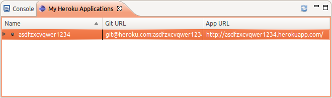

<link href="index.css" rel="stylesheet" type="text/css">

Heroku Enterprise Developer Workshop
====================================

    Document Date: July 16, 2012
    Document Home: http://enterprise-workshop.herokuapp.com

[Download the PDF](workbook.pdf)

This workshop will give you an introduction to building enterprise Java applications on Force.com and Heroku.

* [Chapter 1: Getting Started with Spring MVC on Heroku](#chapter1)
* [Chapter 2: Building a RESTful API](#chapter2)
* [Chapter 3: Integrating with Force.com](#chapter3)
* [Chapter 4: Distributed Sessions on Heroku](#chapter4)
* [Chapter 5: Real-time Push notifications](#chapter5)
* [Chapter 6: Performance Monitoring with New Relic](#chapter6)
* [Chapter 7: Searching Logs with Papertrail](#chapter7)
* [Appendix A: Further Learning](#appendix-a)

Setup and Installation
----------------------

Before you get started you will need to install these prerequisites:

* Network (SSH) access to heroku.com
    1. For Linux or MacOSX, either use an SSH client or `telnet` to verify the network connectin by running one of the following in a command prompt / terminal.  On Microsoft Windows you can use a tool called [PuTTY](http://www.chiark.greenend.org.uk/~sgtatham/putty/download.html):

            ssh -T heroku.com 22
            telnet heroku.com 22

    2. If the connection is refused then you will need to ask your network administrators to open up SSH access to `heroku.com` (port 22).

* Java SE 6 - JDK:

        $ java -version
        java version "1.6.0_37"
        Java(TM) SE Runtime Environment (build 1.6.0_37-b06-434-10M3909)
        Java HotSpot(TM) 64-Bit Server VM (build 20.12-b01-434, mixed mode)

    [http://www.oracle.com/technetwork/java/javase/downloads/index.html](http://www.oracle.com/technetwork/java/javase/downloads/index.html)

* Eclipse 3.7 "Indigo" (Eclipse IDE for Java EE Developers): 

     

    [http://www.eclipse.org/downloads/packages/release/indigo/sr2](http://www.eclipse.org/downloads/packages/release/indigo/sr2)

*Newer versions of Eclipse seem to work with the Heroku Eclipse plugin.  Eclipse versions earlier than 3.7 are missing several other plugins that the heroku plugin relies.  Also the template project used in this workshop may not be recognised by earlier versions of Eclipse.*

* Heroku Eclipse Plugin
    1. In Eclipse select `Help` from the menu bar
    2. Select `Install New Software...`
    3. Select `Add...`
    4. In the `Location` field enter: http://eclipse-plugin.herokuapp.com/install
    5. Select `Ok`
    6. Once `Heroku Eclipse Integration` appears in the list, check the box to its left
    7. Select `Next`
    8. Follow the dialogs to complete the installation

* Heroku Account
    1. In your browser navigate to: [https://heroku.com/signup](https://heroku.com/signup)
    2. Enter your email address
    3. Select `Sign Up`
    4. Check your email and navigate to the verification page

* Salesforce.com Developer Edition Account
    1. In your browser navigate to: [http://developer.force.com/](http://developer.force.com/)
    2. Select `JOIN NOW`
    3. Complete and submit the form
    4. Check your email and navigate to the verification page
    5. Complete and save the form to set your password

Configure Eclipse
-----------------

Now that you have everything installed you will need to configure the Heroku settings in Eclipse.  Navigate to the Eclipse preferences:

* On Windows / Linux:
    1. In Eclipse select `Window` from the menu bar
    2. Select `Preferences`

* On Mac:

    1. In Eclipse select `Eclipse` from the menu bar
    2. Select `Preferences`

Now you will configure the API key for Heroku.

1. Select Heroku from the list on the left
2. Enter the email address you used for your Heroku account in the `Email` field
3. Enter your password in the `Password` field
4. Select `Login`

The Heroku Eclipse Plugin uses Eclipse's Secure Storage system to store the Heroku API key.  You may be prompted to setup a master password or authenticate with your operating system's key chain tool.

Your API key for Heroku is now setup.  You may now need to setup an SSH key for authenticating to Heroku for file uploads using Git.  You can use an existing SSH key or create a new one.  If you aren't sure if you have an existing SSH key, then create a new one.

To use an existing SSH key:

1. Select `Load SSH Key`
2. Locate the public key on your file system
3. Select `Ok`
4. Select `Add` to add the SSH key to your Heroku account

To create a new SSH key:

1. Select `Generate` to be taken to the SSH2 preferences
2. Select the `Key Management` tab
3. Select `Generate RSA Key`
4. Optionally set a password for the SSH key
5. Select `Save Private Key...`
6. Save the key to the file system (usually SSH keys are stored in a `.ssh` directory inside the user's home directory)
7. Select `Heroku` from the preferences list on the left
8. Select `Load SSH Key`
9. Locate the newly created public key and select it
10. Select `OK`
11. Select `Add` to add the SSH key to your Heroku account
12. Verify that your Heroku preferences look similar to this:

    

13. Select `Ok` to save all of the settings

Now that everything is setup you will create your first application on Heroku using a Spring MVC template application.

<a id="chapter1">Chapter 1: Getting Started with Spring MVC on Heroku</a>
-------------------------------------------------------------------------

Goals: In this chapter you will learn how to instantly deploy an application on Heroku using the Heroku Eclipse Plugin and an application template.  You will also learn how to run the new application locally, make changes, and synchronize the changes with Heroku.  Then you will learn how to instantly scale your application, set configuration parameters through environment variables, and view your application's log entries.

Get started:

1. From the Eclipse menu bar select `File`
2. Select `New`
3. Select `Project...`
4. Expand the `Heroku` section
5. Select `Create Heroku App from Template`
6. Select `Next`
7. If prompted for your `secure storage password` enter it and select `Ok`
8. Pick a name for your application.  The name needs to be unique across all of the apps on Heroku.  __It can only contain lower case letters, numbers, and dashes.__  Enter that name in the `Application Name` field.
9. Select `Spring MVC & Tomcat Application`
10. Select `Finish`

You now have a simple Spring MVC application in Eclipse which has also been deployed on Heroku.  View your application on Heroku in your web browser by navigating to `http://yourappname.herokuapp.com` (replacing `yourappname` with the name you selected for your application).

The default page of the application is the instructions for pulling the application into your local development environment.  You've already done that using the Heroku Eclipse plugin, so you won't need to follow those.  To see the simple CRUD application in action select the `people page` link in the first paragraph of text where you should see:

Add a new `Person` to the database to verify the application is working correctly.

In order to scale an app or add add-ons your Heroku account will either need to be verified or your app can be transferred to an organization on Heroku.  Verifying your account requires a credit card and following this tutorial will potentially cause some charges to be applied to your account.  If you'd like to verify your account navigate to [https://api.heroku.com/verify](https://api.heroku.com/verify) in your browser and complete the process.  Otherwise, to transfer ownership of your application to an organization, follow these steps:

1. Navigate to the Heroku preferences in Eclipse
2. Select the `API Key` and copy it into your copy buffer
3. In your browser navigate to: [https://app-transfer.herokuapp.com/](https://app-transfer.herokuapp.com/)
4. Paste your `API Key` into the `API Key` field
5. In the `App Name` field enter the name of your app
6. Select `Submit`

This project uses Apache Maven for managing its dependencies and to build the project.  You can see the dependency and build definition in the `pom.xml` file.  Among the dependencies you will see Spring MVC.  You will also see a section for the `maven-dependency-plugin` which copies `webapp-runner` into a directory when the Maven `package` phase runs.  This makes it easy to run the application with `webapp-runner`, a simple wrapper around Apache Tomcat.

Heroku is instructed to run the application using a file named `Procfile` in the project's root directory.  The `Procfile` for this application contains:

    web: java $JAVA_OPTS -jar target/dependency/webapp-runner.jar --port $PORT target/*.war

This tells Heroku that, for the `web` process, it should run the `webapp-runner` with Java, listening to the HTTP port specified by the `PORT` environment variable and running the WAR file that was created by the Maven build.

You can run this application locally within Eclipse to test changes before deploying them on Heroku.  Setup a new `Run Configuration` for `webapp-runner`:

1. In Eclipse select `Run` from the menu bar
2. Select `Run Configurations...`
3. Select `Java Application`
4. Select the `New launch configuration` icon (the icon above the filter field that represents a new file)
5. In the `Name` field enter `webapp-runner for x` (replacing x with your project name)
6. In the `Main class` field enter `webapp.runner.launch.Main`
7. Select `Browse...` next to the `Project` field
8. Select your project from the list
9. Select `Apply`
10. Select the `Arguments` tab
11. In the `Program arguments` field enter `src/main/webapp`
12. Select `Run`

Test that the application is working locally by opening [http://localhost:8080](http://localhost:8080) in your browser.  You should see something similar to what you saw with your application on Heroku.  Test that the application is working with the database by visiting the `people page` and adding a `Person`.  When running locally this application uses an in-memory database.

Now lets make a simple change to the application, test that change locally, and then deploy the change on Heroku.

1. In Eclipse open the `src/main/webapp/WEB-INF/jsp/people.jsp` file
2. Locate the line that displays each person's name:

         <td>${person.lastName}, ${person.firstName}</td>

3. Change the line to be:

         <td>${person.firstName} ${person.lastName}</td>

4. Save the file (From the Eclipse menu bar select `File` then select `Save`)
5. Reload the [http://localhost:8080/people/](http://localhost:8080/people/) page in your browser and you should now see the names displayed with the first name first.

Now you will deploy this change on Heroku.

1. In Eclipse select the project's context menu (right-click on the project in the `Project Explorer` panel
2. Select `Team`
3. Select `Commit...`
4. Select the `people.jsp` file in the `Unstaged Changes` list on the left and click the `>` button to move it to the `Staged changes` list on the right.
5. Enter a `Commit message` like `Flipped first and last name`
6. Select `Commit`

This commits your changes to your local Git repository.  Those changes need to be pushed to Heroku.

1. In Eclipse select the project's context menu
2. Select `Team`
3. Select `Push` (the menu item may be named `Push to Upstream`)

This process will take about a minute to run.  The changes are uploaded to Heroku where Heroku runs the Maven build on the project and then deploys the new version.  Once that process is complete you should see a confirmation like the following:

Now verify your changes are live on Heroku by visiting your application's `people page` (the `herokuapp.com` version, not the `localhost` version).

To view the logs for your application on Heroku, start by opening the `My Heroku Applications` view in Eclipse:

1. In Eclipse select `Window` from the menu bar
2. Select `Show View`
3. Select `Other...`
4. Expand `Heroku` in the list
5. Select `My Heroku Applications`
6. Select `Ok`
7. You should now see a list of your applications on Heroku in the `My Heroku Applications` view:

    

8. Select the context menu for the application (right-click on the application)
9. Select `View Logs`

You will now see the logs for your application on Heroku in the `Console` view.  If you make a request to the application in your browser then you will now see the request logged in the `Console` view.

You can see the status for the web process from the `Procfile` by expanding the application in the `My Heroku Applications` view.

To see the application details:

1. In the `My Heroku Applications` view in Eclipse select the context menu for the application
2. Select `App Info`

Collaborators can be added to an application in order to allow other developers access to push changes and manage the application.  To add a collaborator to the application:

1. Navigate to the Heroku application details
2. Select the `Collaborators` tab
3. Select `+`
4. In the `Email` field enter an email address
5. Select `OK`

By default the application runs on one Dyno.  You can allocate (i.e. scale) as many Dynos as you want to the application's processes.  To scale the web process to five dynos:

1. In the `My Heroku Applications` view in Eclipse select the context menu for the application
2. Select `Scale`
3. In the `Scale to` field enter `5`
4. Select `Ok`

Verify that the `web` process has been scaled to 5 Dynos:

1. In the `My Heroku Applications` view in Eclipse select the context menu for the application
2. Select `App Info`
3. Select the `Processes` tab
4. Verify that the `web` process has 5 Dynos

Heroku uses environment variables to handle configuration values that vary between environments.  To add a new environment variable to the application:

1. Navigate to the Heroku application details
2. Select the `Environment Variables` tab
3. Select `+`
4. In the `Key` field enter `FOO`
5. In the `Value` field enter `bar`
6. Select `Ok`

You should now see the `Foo` environment variable along with the other default environment variables.

Heroku provides a large ecosystem of cloud services that can be instantly provisioned for your application.  To see the list of Heroku Add-ons navigate to [http://addons.heroku.com](http://addons.heroku.com) in your browser.  If you are logged into heroku.com you can add add-ons to your application from your web browser.  You will do this shortly.

If needed you can destroy your applications on Heroku by selecting `Destroy` from the context menu for an application in the `My Heroku Applications` view.  This will destroy the application, the Git repository, all add-ons, and all data for an application.

<a id="chapter2">Chapter 2: Building a RESTful API</a>
------------------------------------------------------

Goals: In this chapter you will add a RESTful JSON service to the application from Chapter 1 and consume the JSON service with a jQuery / JavaScript application.

The application you started with is a pretty typical Java web application that uses JSPs for generating web pages on the server.  It is becoming much more common for web applications to expose serialized data in a RESTful architecture for web and mobile consumption.  Now you will add a service to the application that will return the list of people as serialized data using the JavaScript Object Notation (JSON).

Start by adding the jQuery and Jackson JSON libraries to your project dependencies:

1. In Eclipse open the `pom.xml` file
2. Select the `pom.xml` tab at the bottom of the file
3. Add the `webjars` repository within the `project` section:

        <repositories>
            <repository>
                <id>webjars</id>
                <url>http://webjars.github.com/m2</url>
            </repository>
        </repositories>

4. Add these dependencies to the `dependencies` section:

        <dependency>
            <groupId>org.codehaus.jackson</groupId>
            <artifactId>jackson-mapper-asl</artifactId>
            <version>1.9.7</version>
        </dependency>
        <dependency>
            <groupId>com.jquery</groupId>
            <artifactId>jquery</artifactId>
            <version>1.7.2-1</version>
        </dependency>

    Your new `pom.xml` should look similar to:

    

5. Save the file (From the Eclipse menu bar select `File` then select `Save`)

Now add a new method to the `src/main/java/com/example/controller/PersonController.java` file:

1. Add these import statements below the `package` line:

        import java.util.List;
        import org.springframework.http.MediaType;
        import org.springframework.web.bind.annotation.ResponseBody;

2. Add a new method within the `public class` block:

        @RequestMapping(value = "/people.json", method = RequestMethod.GET, produces = MediaType.APPLICATION_JSON_VALUE)
        public @ResponseBody List<Person> listPeople() {
            return personService.listPeople();
        }

3. Save the file (From the Eclipse menu bar select `File` then select `Save`)
4. Terminate the running process by opening the `Console` view, select the webapp-runner process from the list of consoles (using the drop-down arrow next to the computer screen), and select the stop / terminate button (the square, red button)

    

5. Restart the `webapp-runner` process by selecting `Run` from the menu bar then select `Run`

Verify that the JSON service works by opening [http://localhost:8080/people/](http://localhost:8080/people/) in your browser and adding a couple of new people to the database (remember, when the app is running locally, it's using an in-memory database, so the person you added earlier will be gone).  Then open [http://localhost:8080/people/people.json](http://localhost:8080/people/people.json) in your browser and you should see a JSON encoded list of the people in your database.

Now you will add a HTML file that will load and render the people through JavaScript / jQuery:

1. In Eclipse open the `src/main/resources/applicationContext.xml` file
2. Below the line containing:

        <mvc:annotation-driven/>

    Add the following :

        <mvc:resources location="classpath:public/" mapping="/assets/**"/>

    This sets up a mapping that will allow you to load jQuery from the webjar.
2. Save the file (From the Eclipse menu bar select `File` then select `Save`)
3. Create a new file named `src/main/webapp/people.html` (Right-click on the `src/main/webapp` folder, select `New`, select `File`) that contains:

        <!DOCTYPE html>
        <html>
        <head>
        
        
        </head>
        <body>
            <ul id="people"></ul>
        </body>
        </html>

4. Save the file (From the Eclipse menu bar select `File` then select `Save`)
5. Restart the server again (terminate and run like before)
6. Add some new people to your in-memory database by navigating to [http://localhost:8080/people/](http://localhost:8080/people/) in your browser and adding a couple of new people to the database.
7. Test the new web page by loading [http://localhost:8080/people.html](http://localhost:8080/people.html) in your browser

Now deploy your changes on Heroku (like before) by committing the changes to your local Git repository (making sure you add `people.html` to the repo) and then pushing the changes to Heroku.  Then verify that the new `people.html` page works on Heroku.

<a id="chapter3">Chapter 3: Integrating with Force.com</a>
-------------------------------------

Goals: In this chapter you will create a new application that integrates with Force.com from a Heroku template application.  You will learn how to setup OAuth on Salesforce.com so that the application can make API calls on behalf of the end user of the application.  After you have the application running locally and on Heroku you will add a new field to the `Contact` object on Salesforce.com and update your application to expose the new field.

Now that you've learned the basics of deploying Java apps on Heroku you will deploy a Java application that integrates with Force.com through RESTful APIs.

Start by creating a new project from the `Force.com connected Java app with Spring,OAuth` template:

1. From the Eclipse menu bar select `File`
2. Select `New`
3. Select `Project...`
4. Expand the `Heroku` section
5. Select `Create Heroku App from Template`
6. Select `Next`
7. If prompted for your `secure storage password` enter it and select `Ok`
8. Pick a name for your application.  The name needs to be unique across all of the apps on Heroku.  __It can only contain lower case letters, numbers, and dashes.__  Enter that name in the `Application Name` field.
10. Select `Force.com connected Java app with Spring,OAuth`
11. Select `Finish`

If you have not associated a credit card with your Heroku account, your new app will need to be transferred so that you will be able to add add-ons:

1. In Eclipse navigate to the Heroku preferences
2. Select the `API Key` and copy it into your copy buffer
3. In your browser navigate to: [https://app-transfer.herokuapp.com/](https://app-transfer.herokuapp.com/)
4. Paste your `API Key` into the `API Key` field
5. In the `App Name` field enter the name of your app
6. Select `Submit`

This template application uses OAuth to authenticate a user with Force.com.  To setup OAuth you will need to configure a connected application on Force.com.

1. Login to [Salesforce.com](http://salesforce.com) using the Developer Edition credentials you setup earlier
2. Select your name in the top right and select `Setup`
3. On the left, expand `Create` and select `Apps`
4. Scroll down to `Connected Apps` and select `New`
5. In the `Application` field enter `local-spring`
6. In the `Contact Email` field enter your email address
7. Enter `http://localhost:8080/_auth` in the `Callback URL` field
8. Select `Access and manage your data`, `Access your basic information` and `Perform requests on your behalf at any time` from the `Available OAuth Scopes` and use the `Add` buttom to move them to `Selected OAuth Scopes`:

    

9. Select `Save`
10. Leave the `Connected App Detail` page open because shortly you will need some information from it

Now that OAuth is configured on Salesforce.com we can run this application locally to test it.  In Eclipse:

1. If you have a webapp-runner actively running then terminate the running process by opening the `Console` view, select the `webapp-runner` process from the list of consoles (using the drop-down arrow next to the computer screen), and select the stop / terminate button (the square, red button)
2. Select the `Run` menu
3. Select `Run Configurations...`
4. Select `Java Application`
5. Select the `New launch configuration` icon (the icon above the filter field that represents a new file)
6. In the `Name` field enter `webapp-runner for x` (replacing x with your project name)
7. In the `Main class` field enter `webapp.runner.launch.Main`
8. Select `Browse...` next to the `Project` field
9. Select your project from the list
10. Select `Apply`
11. Select the `Arguments` tab
12. In the `Program arguments` field enter `src/main/webapp`
13. Select the `Environment` tab
14. Select `New`
15. In the `Name` field enter `SFDC_OAUTH_CLIENT_ID`
16. Retrieve the `Consumer Key` value from the `Connected App Detail` page on Salesforce.com then copy and paste it into the `Value` field
17. Select `Ok`
18. Select `New`
19. In the `Name` field enter `SFDC_OAUTH_CLIENT_SECRET`
20. Retrieve the `Consumer Secret` value from the `Connected App Detail` page then copy and paste it into the `Value` field
21. Select `Ok`
22. Select `Run` to start the application

Now that the application is up and running you can test it in your browser by visiting:
[http://localhost:8080/](http://localhost:8080/)

The index page is unprotected and should load without having to authenticate.  Now load the "Contacts" page by visiting:
[http://localhost:8080/sfdc/contacts](http://localhost:8080/sfdc/contacts)

You should now be redirected to Salesforce.com's OAuth handshake page.  Select `Allow` to do the OAuth handshake.  You will then be redirected back to the "Contacts" page which should now display a list of your Salesforce.com contacts.  (Note: Developer Edition accounts have a few contacts out-of-the-box.)  Test that creating and deleting contacts also works.

The application is already running on Heroku but in order for it to work properly you need to configure the `SFDC_OAUTH_CLIENT_ID` and `SFDC_OAUTH_CLIENT_SECRET` environment variables.  You will need to setup a new `Connected Application` on Salesforce.com that has the `Callback URL` for the application on Heroku.

1. Login to [Salesforce.com](http://salesforce.com)
2. Select your name in the top right and select `Setup`
3. On the left, expand `Create` and select `Apps`
4. Scroll down to `Connected Apps` and select `New`
5. In the `Application` field enter `yourappname-spring` (replace `yourappname` with your app name)
6. In the `Contact Email` field enter your email address
7. Enter `https://yourappname.herokuapp.com/_auth` in the `Callback URL` field (replace `yourappname` with your app name and insure you use `https` for the protocol)
8. Select `Access and manage your data`, `Access your basic information` and `Perform requests on your behalf at any time` from the `Available OAuth Scopes` and use the `Add` buttom to move them to `Selected OAuth Scopes`:
9. Select `Save`
10. Leave the `Connected App Detail` page open because shortly you will need some information from it

You now have a new `Consumer Key` and `Consumer Secret` that will be used for your app on Heroku.  Those values will need to be set as environment variables on your Heroku application.

1. In the `My Heroku Applications` view in Eclipse select the application's context menu
2. Select `App Info`
3. Select the `Environment Variables` tab
4. Select the `SFDC_OAUTH_CLIENT_ID` row
5. Click 'Edit'
6. Retrieve the `Consumer Key` value from the `Connected App Detail` page on Salesforce.com then copy and paste it into the `Value` field, overwriting the default value
7. Select the `SFDC_OAUTH_CLIENT_SECRET` row
8. Click 'Edit'
9. In the `Key` field enter `SFDC_OAUTH_CLIENT_SECRET`
10. Retrieve the `Consumer Secret` value from the `Connected App Detail` page then copy and paste it into the `Value` field, overwriting the default value
11. Select `OK`

To test the application on Heroku navigate to `https://yourappname.herokuapp.com` in your browser (replace `yourappname` with your app name and insure you use `https` for the protocol).  Opening the "Contacts" page should trigger the OAuth handshake and then display your contacts.

Now that the application is working lets make a simple modification to it.  Lets add a Twitter handle field to the `Contact` object on Salesforce.com:

1. Login to [Salesforce.com](http://salesforce.com)
2. Select your name in the top right and select `Setup`
3. On the left, expand `Customize` then expand `Contacts`
4. Select `Fields`
5. Next to `Contact Custom Fields & Relationships` select `New`
6. Select `Text` as the data type
7. Select `Next`
8. In the `Field Label` field enter `TwitterHandle`
9. In the `Length` field enter `64`
10. Select `Next`
11. Select `Next`
12. Select `Save`

Now that the field has been added, test it by adding a Twitter handle to a Contact:

1. On [Salesforce.com](http://salesforce.com) select the `Contacts` tab
2. Next to the `All Contacts` drop-down select `Go`
3. Pick a contact and select `Edit`
4. Locate the `TwitterHandle` field and enter a fictitious Twitter handle
5. Select `Save`

You will now need to modify your Java application to display the new Twitter handle for the contacts.

1. In Eclipse open the `src/main/java/com/example/controller/ContactsController.java` file and locate the line:

        map.put("contactList", salesforceService.query("select Id,FirstName,LastName,Email FROM Contact"));

2. Update the SOQL query to include the new `TwitterHandle` field:

        map.put("contactList",
            salesforceService.query("select Id,FirstName,LastName,Email,TwitterHandle__c FROM Contact"));

    The `__c` (with two underscores) indicates that the field is a custom field.
3. Save the file (From the Eclipse menu bar select `File` then select `Save`)
4. In Eclipse open the `src/main/webapp/WEB-INF/jsp/contacts.jsp` file
5. Add a new line beneath:

        <th>Email</th>

    Containing:

        <th>Twitter</th>

6. Add a new line beneath:

        <td>${contact.getField("email").value}</td>

    Containing:

        <td><a href="http://twitter.com/${contact.getField("twitterhandle__c").value}">
            ${contact.getField("twitterhandle__c").value}</a></td>

7. Save the file (From the Eclipse menu bar select `File` then select `Save`)

Test your change locally by restarting the local server and opening [http://localhost:8080/sfdc/contacts](http://localhost:8080/sfdc/contacts) in your browser.  You should see a new column containing the Twitter handle.

You can now deploy your changes on Heroku.  First commit the changes to your local Git repository:

1. In Eclipse select the project's context menu (right-click on the project in the `Project Explorer` panel
2. Select `Team`
3. Select `Commit...`
4. Enter a `Commit message` like `Added Twitter Handle`
5. Select `Commit`

Now push your changes to Heroku

1. In Eclipse select the project's context menu
2. Select `Team`
3. Select `Push`

Test the new version of the application on Heroku by navigating to `https://yourappname.herokuapp.com` in your browser (replace `yourappname` with your app name and insure you use `https` for the protocol).  Open the "Contacts" page and you should now see the new `Twitter` column.

<a id="chapter4">Chapter 4: Distributed Sessions on Heroku</a>
--------------------------------------------------------------

Goals: In order to scale your application instantly and perform instant upgrades your session state needs to be moved to an external session store.  This chapter will teach you how to use the Heroku Memcache Add-on to externalize your session state.

Heroku's Dynos are meant to be used in a stateless fashion for instant scalability and updates.  Some Java applications use session state to manage context across requests.  Spring Security uses session state to identify a user across requests.  To handle the use of session state you need to externalize the state.  Since this application uses `webapp-runner` it is very easy to externalize the session state by adding the Memcache Heroku Add-on and configuring `webapp-runner` to use it.

1. In your browser navigate to [https://api.heroku.com/login](https://api.heroku.com/login) and login
2. Navigate to [https://addons.heroku.com/memcache](https://addons.heroku.com/memcache)
3. Select `Add` for the free 5MB plan
4. Select the application from the drop-down
5. Select `+`
6. In Eclipse open the `Procfile` and change line 1 to be:

        web:  java $JAVA_OPTS -jar target/dependency/webapp-runner.jar --port $PORT --session_manager memcache target/*.war

    This enables `webapp-runner` to use the provisioned Memcache service for externalized session storage
7. Save the file (From the Eclipse menu bar select `File` then select `Save`)

Now commit the changes to the local Git repository and push them to Heroku:

1. In Eclipse select the project's context menu (right-click on the project in the `Project Explorer` panel
2. Select `Team`
3. Select `Commit...`
4. Enter a `Commit message` like `Switched on Memcache session management`
5. Select `Commit`
6. Select the project's context menu
7. Select `Team`
8. Select `Push`

Verify that your application still works on Heroku.

<a id="chapter5">Chapter 5: Real-time Push notifications</a>
------------------------------------------------------------

Goals: Real-time is becoming a standard feature of web applications.  This chapter will teach you how to use the PubNub Heroku Add-on to push notifications to the browser in real-time.

With Heroku it's easy to at real-time push notifications to an application.  You will now add a notification that triggers every time a Contact is updated through your application on Heroku.  You will use the PubNub Heroku add-on to do the real-time push.

First add a Maven repository to the `project` section of your `pom.xml` file for the PubNub library:

    <repositories>
        <repository>
            <id>pubnub-repo</id>
            <url>http://pubnub-repo.herokuapp.com/</url>
        </repository>
    </repositories>

Also in the `pom.xml` file add the `pubnub` library as a dependency in the `dependencies` section:

    <dependency>
        <groupId>pubnub</groupId>
        <artifactId>pubnub</artifactId>
        <version>3.1</version>
    </dependency>

Create a new file named `src/main/java/com/example/services/PubnubService.java` containing:

    package com.example.services;

    import org.json.JSONException;
    import org.json.JSONObject;

    import pubnub.Pubnub;

    public class PubnubService {
        public static void pushUpdate(String id) {
            try {
                String publishKey = System.getenv("PUBNUB_PUBLISH_KEY");
                String subscribeKey = System.getenv("PUBNUB_SUBSCRIBE_KEY");
                String secretKey = System.getenv("PUBNUB_SECRET_KEY");

                JSONObject jsonObject = new JSONObject();
                jsonObject.put("id", id);
                jsonObject.put("action", "updated");

                Pubnub pubnub = new Pubnub(publishKey, subscribeKey, secretKey);
                pubnub.publish(id, jsonObject);
            }
            catch (JSONException e) {

            }
        }
    }

In the `src/main/java/com/example/controller/ContactsController.java` file add these import statements:

    import com.example.services.PubnubService;
    import org.springframework.http.MediaType;
    import org.springframework.web.bind.annotation.ResponseBody;

Also in the `ContactsController` class add a new method to retrieve a `Contact` as JSON:

    @RequestMapping(value = "/{id}/json", produces = MediaType.APPLICATION_JSON_VALUE)
    public @ResponseBody Map<String, Object> getContactDetail(@PathVariable("id") String id) {
        return salesforceService.fetch("Contact", id).getRaw();
    }

Then in the `updateContact` method, below the line containing:

    salesforceService.update(record);

Add the following:

    PubnubService.pushUpdate(id);

In the `src/main/webapp/WEB-INF/jsp/footer.jsp` file, below the line containing:

    

Add the following:

    

In the `src/main/webapp/WEB-INF/jsp/contacts.jsp` file, below the line containing:

    <jsp:include page="header.jsp"/>

Add the following:

    
"
        sub-key="<%=System.getenv("PUBNUB_SUBSCRIBE_KEY")%>" ssl="off" origin="pubsub.pubnub.com" id="pubnub">

    

    

And below the line containing:

    <c:forEach items="${contactList}" var="contact">

Add the following:

    

Save all of the files.

Now your application will display a message on the "Contacts" page each time someone updates a `Contact` through the application.  That message will be pushed out in real-time to all of the users of the application.

To configure PubNub you will need to add the PubNub Heroku Add-on then obtain and set the required environment variables:

1. Navigate in your browser to [https://addons.heroku.com/pubnub](https://addons.heroku.com/pubnub)
2. Select `Add` for the free "Pulse Sandbox" level of service
3. Select your application from the drop-down
4. Select `+`
5. When the PubNub service has been installed, select PubNub from the list of resources in your application

The `PUBLISH KEY`, `SUBSCRIBE KEY`, and `SECRET KEY` values will need to be added to your local runtime configuration and to your environment variables on Heroku.

First add these to your local run configuration so you can test locally.  In Eclipse:

1. If you have a webapp-runner actively running then terminate the running process by opening the `Console` view, select the webapp-runner process from the list of consoles (using the drop-down arrow next to the computer screen), and select the stop / terminate button (the square, red button)
2. Select the `Run` menu
3. Select `Run Configurations...`
4. Select the configuration on the left named `webapp-runner for x` (replacing x with your project name)
5. Select the `Environment` tab
6. Select `New`
7. In the `Name` field enter `PUBNUB_PUBLISH_KEY`
8. Retrieve the `PUBLISH KEY` value from the PubNub Heroku Add-on page then copy and paste it into the `Value` field
9. Select `Ok`
10. Select `New`
11. In the `Name` field enter `PUBNUB_SUBSCRIBE_KEY`
12. Retrieve the `SUBSCRIBE KEY` value from the PubNub Heroku Add-on page then copy and paste it into the `Value` field
13. Select `Ok`
14. Select `New`
15. In the `Name` field enter `PUBNUB_SECRET_KEY`
16. Retrieve the `SECRET KEY` value from the PubNub Heroku Add-on page then copy and paste it into the `Value` field
17. Select `Ok`
18. Select `Run` to start the application

To test the real-time push you will need two browser windows.  Open both to the [http://localhost:8080/sfdc/contacts](http://localhost:8080/sfdc/contacts) page.  Then in one browser select a contact to edit (by selecting the contact name).  Then select edit, make a change, and select `Save`.  In your other browser you should see a notification that the Contact was updated.

Before you deploy these changes on Heroku set the environment variables for PubNub:

1. In the `My Heroku Applications` view in Eclipse select the application's context menu
2. Select `App Info`
3. Select the `Environment Variables` tab
4. Select `+`
5. In the `Key` field enter `PUBNUB_PUBLISH_KEY`
6. Retrieve the `PUBLISH KEY` value from the PubNub Heroku Add-on page then copy and paste it into the `Value` field
7. Select `OK`
8. Select `+`
9. In the `Key` field enter `PUBNUB_SUBSCRIBE_KEY`
10. Retrieve the `SUBSCRIBE KEY` value from the PubNub Heroku Add-on page then copy and paste it into the `Value` field
11. Select `OK`
12. Select `+`
13. In the `Key` field enter `PUBNUB_SECRET_KEY`
14. Retrieve the `SECRET KEY` value from the PubNub Heroku Add-on page then copy and paste it into the `Value` field
15. Select `OK`

Now deploy your changes:

1. In Eclipse select the project's context menu (right-click on the project in the `Project Explorer` panel
2. Select `Team`
3. Select `Commit...`
4. Enter a `Commit message` like `Added real-time push with PubNub`
5. Check the box to add the new `PubnubService.java` file to the repo
6. Select `Commit`
7. Select the project's context menu
8. Select `Team`
9. Select `Push`

Verify that the real-time push notifications work in your application on Heroku.

<a id="chapter6">Chapter 6: Performance Monitoring with New Relic</a>
---------------------------------------------------------------------

Goals: With the New Relic Heroku Add-on you can easily setup application performance monitoring and reporting.  This chapter will teach you how to add New Relic to your application.

New Relic provides an in-depth view into the performance and memory usage of applications on Heroku.

Start by adding the New Relic Add-on:

1. Navigate in your browser to [https://addons.heroku.com/newrelic](https://addons.heroku.com/newrelic)
2. Select `Add` for the free "Standard" level of service
3. Select your application from the drop-down
4. Select `+`

Now your application needs to be configured to use the New Relic Java agent:

1. Download the newest New Relic Java Agent zip file from [http://download.newrelic.com/newrelic/java-agent/newrelic-api/](http://download.newrelic.com/newrelic/java-agent/newrelic-api/)
2. Unzip the archive
3. Copy the `newrelic.jar` and `newrelic.yml` files into the root directory of your project

Commit these new files to your Git repository and push the new version to Heroku:

1. In Eclipse select the project's context menu (right-click on the project in the `Project Explorer` panel
2. Select `Team`
3. Select `Commit...`
4. Enter a `Commit message` like `Added New Relic files`
5. In the `Files` list check the boxes next to the `newrelic.jar` and `newrelic.yml` files
5. Select `Commit`
6. Select the project's context menu
7. Select `Team`
8. Select `Push`

You need to change the default `JAVA_OPTS` environment variable for your application to the Java process to use the New Relic Java agent.

1. In Eclipse, in the `My Heroku Applications` view select the application's context menu
2. Select `App Info`
3. Select the `Environment Variables` tab
4. Select the environment variable with the key of `JAVA_OPTS`
5. Select `Edit`
6. In the `Value` field enter `-Xmx384m -Xss512k -XX:+UseCompressedOops -javaagent:newrelic.jar`
7. Select `OK`

Test the application on Heroku in your browser and verify that it works as expected.

You can now browse the New Relic Dashboard:

1. In your browser navigate to [https://api.heroku.com/myapps](https://api.heroku.com/myapps)
2. Select the application you added New Relic to
3. Select the `Add-ons` drop-down
4. Select `New Relic`

Explore the New Relic dashboard.  (Note: It might take a few minutes for some data to appear in the dashboard.)

<a id="chapter7">Chapter 7: Searching Logs with Papertrail</a>
--------------------------------------------------------------

Goals: This chapter will teach you how to add the Paptertrail Heroku Add-on to your application.  Papertrail provides a robust web interface for searching your application's logs and setting alerts for specific searches.

To add the Papertrail Add-on:

1. Navigate in your browser to [https://addons.heroku.com/papertrail](https://addons.heroku.com/papertrail)
2. Select `Add` for the free "Choklad" level of service
3. Select your application from the drop-down
4. Select `+`
5. Open the `Add-ons` drop-down for your application
6. Select `Papertrail`

After a minute or so Papertrail will have your latest logs.

Enter a search term like `WARN` in the search box at the bottom of the screen.  You will then see all of the log entries for your application which match that term.

You can setup Papertrail to notify you via email when new log entries matching your search are received:

1. Select `Save Search`
2. Enter a name for the saved search
3. Select `Save & Setup Alert`
4. Select `Emails`
5. In the `Recipients` field enter your email address
6. Choose a `Frequency`
7. Select `Update`

The next time your application has a log event that matches your search, you will receive an email notification.

<a id="appendix-a">Appendix A: Further Learning</a>
-------------------------------------------------

Heroku Basics:

* [How Heroku Works](http://heroku.com/how)
* [Heroku Dev Center](http://devcenter.heroku.com)

Java on Heroku:

* [Java on Heroku Dev Center](https://devcenter.heroku.com/categories/java)
* [Get started with Java on Heroku in your browser](http://java.heroku.com)
* [Heroku Eclipse Plugin](http://eclipse-plugin.herokuapp.com)

Integrating Java with Force.com:

* [Rich SObjects Library](https://github.com/ryanbrainard/richsobjects)
* [Force.com REST API Docs](http://www.salesforce.com/us/developer/docs/api_rest/index.htm)
* [Force.com Developer Resources](http://developer.force.com)

Cloud Application Architecture:

* [12 Factor App](http://12factor.net)
